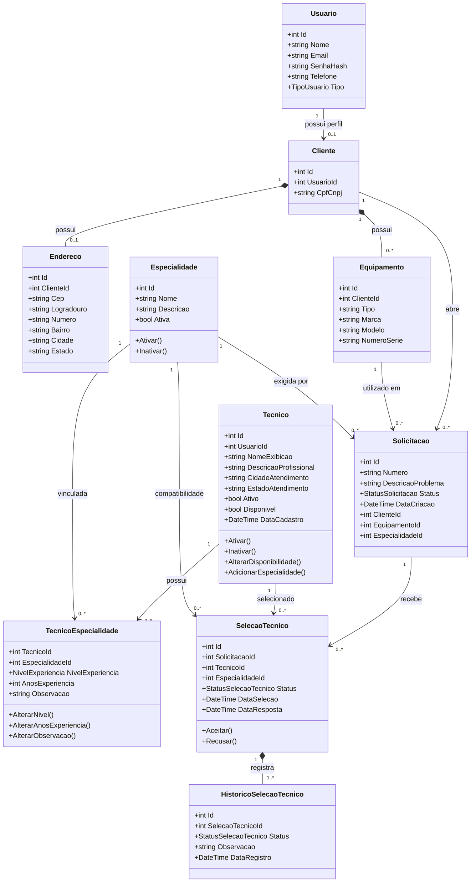

# Modelo de Classes da AV1

## Objetivo

Este documento apresenta as principais classes do domínio implementadas na versão da AV1 do Sistema de Assistência Técnica.

Controllers, DTOs, páginas React e classes de configuração não aparecem no centro do modelo porque não representam conceitos principais do domínio.

## Diagrama



## Multiplicidades

### Usuário e cliente

Um usuário pode possuir um perfil de cliente. O perfil mantém os dados específicos utilizados no sistema de assistência.

### Cliente e endereço

Um cliente pode possuir um endereço. O endereço depende do cliente ao qual está associado.

### Cliente e equipamentos

Um cliente pode possuir vários equipamentos, mas cada equipamento pertence a um único cliente.

### Técnico e especialidade

O relacionamento entre técnico e especialidade é muitos-para-muitos.

A classe `TecnicoEspecialidade` representa esse vínculo e armazena informações adicionais:

- nível de experiência;
- anos de experiência;
- observação.

### Cliente e solicitação

Um cliente pode abrir várias solicitações. Cada solicitação pertence a um único cliente.

### Equipamento e solicitação

Uma solicitação utiliza um equipamento. O equipamento deve pertencer ao cliente responsável pela solicitação.

### Especialidade e solicitação

Cada solicitação exige uma especialidade. Essa informação é utilizada para procurar técnicos compatíveis.

### Solicitação e seleção de técnico

Uma solicitação pode possuir registros de seleção de técnico. O sistema impede que existam duas seleções simultaneamente ativas para a mesma solicitação.

### Seleção e histórico

Cada seleção registra seu estado inicial e suas alterações no histórico.

## Estados principais

### Solicitação

Na AV1, a solicitação é criada com o estado inicial definido pelo domínio.

```text
Aberta
```

Outras etapas do atendimento poderão ser adicionadas na AV2.

### Seleção do técnico

```text
AguardandoResposta
        |
        +--> Aceita
        |
        +--> Recusada
```

Uma seleção que já chegou ao estado `Aceita` ou `Recusada` não pode receber uma nova resposta.

## Responsabilidades principais

### `Tecnico`

- Manter os dados profissionais.
- Controlar ativação e disponibilidade.
- Impedir que técnico inativo fique disponível.
- Controlar o vínculo com especialidades.

### `TecnicoEspecialidade`

- Representar o vínculo entre técnico e especialidade.
- Armazenar o nível de experiência.
- Armazenar e validar os anos de experiência.

### `Solicitacao`

- Representar o pedido de assistência.
- Relacionar cliente, equipamento e especialidade.
- Impedir que o cliente utilize equipamento que não lhe pertence.
- Impedir a utilização de especialidade inativa.

### `SelecaoTecnico`

- Relacionar solicitação, técnico e especialidade.
- Iniciar aguardando a resposta do técnico.
- Controlar as operações de aceite e recusa.
- Impedir uma segunda resposta.

### `HistoricoSelecaoTecnico`

- Registrar o estado da seleção.
- Registrar a data da mudança.
- Guardar uma observação sobre o evento.

## Observações

O modelo representa somente as classes presentes na versão da AV1. Funcionalidades previstas para a AV2, como diagnóstico completo, orçamento, pagamento, execução e avaliação, não foram incluídas neste modelo.